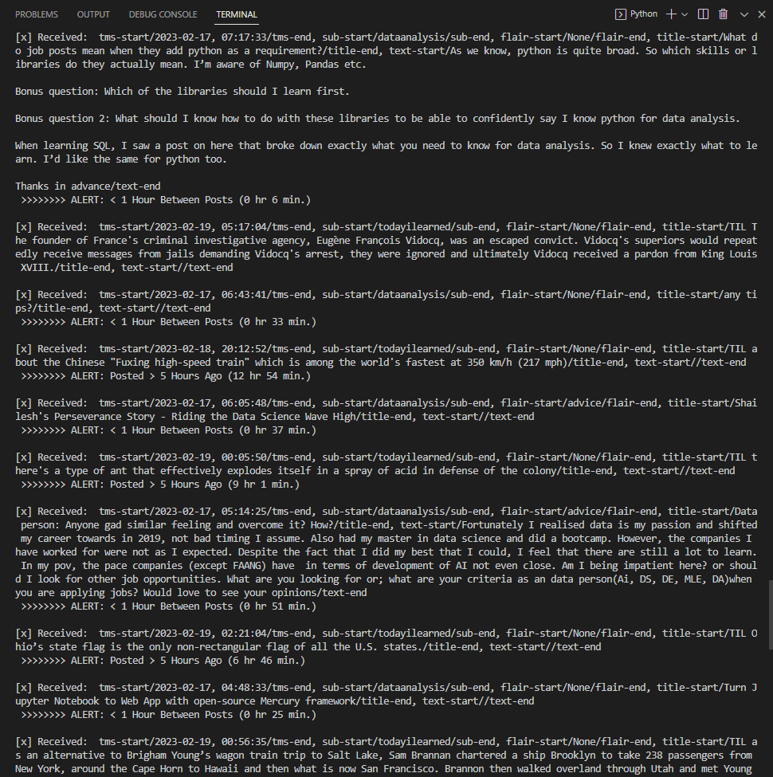
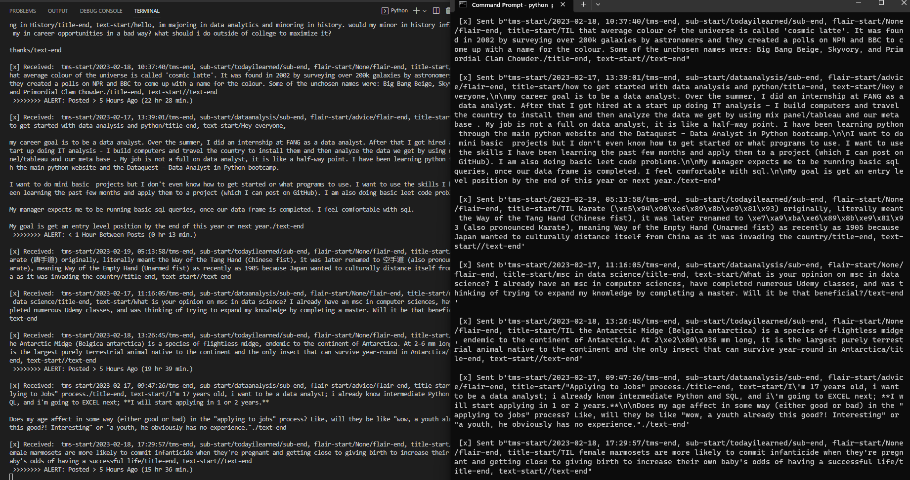

# Amanda Hanway - Streaming Data, Module 7
- Custom Project: Streaming data using the Reddit.com API and RabbitMQ server
- Date: 2/18/23

## Assignment:
- **Project Description**  
    - For my streaming analytics project, I created a program to stream data from reddit.com, an app that I visit frequently. The two communities I chose to use as the data source, r/dataanalysis and r/todayilearned, are pages that I often find useful or interesting information, and have posts that are mostly submitted in text format.
- **Original Data Sources**  
    - [r/dataanalysis](https://www.reddit.com/r/dataanalysis/): 
        - The Data Analysis page is "a subreddit for those doing data analysis". Users post questions and tips related to the field of analytics.    
    - [r/todayilearned](https://www.reddit.com/r/todayilearned/):
        - Today I Learned (TIL) is a subreddit where users post interesting facts. The posts are typcically random pieces of information you didn't know you needed, but may come in handy for your next trivia night. 
- **Program Overview**    
    - Reddit_producer.py
        - This program gets posts from reddit using the API, then streams the post as a message to a corresponding queue on the RabbitMQ server.  
        - The following subreddit pages are set as the source:
            - r/dataanalysis, new posts: https://www.reddit.com/r/dataanalysis/new/
            - r/todayilearned, top posts: https://www.reddit.com/r/todayilearned/top/?t=day
        - The program creates two queues - one queue is used uniquely for each subreddit page.
    - Reddit_consumer.py
        - This program listens for messages from two queues on the RabbitMQ server, continuously. It performs transformations on messages when received, and writes the cleaned message to an output file. An alert is generated when a set amount of time has passed between posts.   
        - Transformations
            - The program attempts to clean the data by removing special characters, line breaks, and splitting the message into corresponding columns. The result is written to the output file.
        - Alerts
            - r/dataanalysis: Alerts are generated when less than one hour or more than four hours have elapsed since the previous post.           
            - r/todayilearned: Alerts are generated when less than one hour or more than five hours have elapsed since the post was created (from the current time).       
- **Output Files**  
    - [r/dataanalysis output](/output_dataanalysis.txt)
    - [r/todayilearned output](/output_todayilearned.txt)

## Prerequisites:
- Requres a reddit.com account and API application
    - Account: username, password
    - Application: personal use script, secret tokens, app name
        -  Setup instructions
            - Visit https://www.reddit.com/prefs/apps 
            - Click "create another app..."
            - Select "script"
            - Fill in an app name, description, and redirect uri
    - Credit to James Briggs for API instructions:  
        - https://towardsdatascience.com/how-to-use-the-reddit-api-in-python-5e05ddfd1e5c
- Libraries:
    - Standard libraries required:  
        - collections 
        - csv
        - datetime 
        - re
        - sys
        - time
        - webbrowser
    - Additional libraries required: 
        - pandas  
        - pika   
        - rabbitmq (server must be installed and running)  
        - requests 
    - Installation instructions:  
        - pandas: https://pandas.pydata.org/docs/getting_started/install.html
        - pika: https://anaconda.org/conda-forge/pika  
        - rabbitmq: https://www.rabbitmq.com/download.html 
        - requests: https://requests.readthedocs.io/en/latest/user/install/       
```
# install rabbitmq on windows using chocolatey
choco install rabbitmq

# install pandas, pika, and requests on windows using conda-forge
conda install -c conda-forge pandas
conda install -c conda-forge pika
conda install -c conda-forge requests
```

## Instructions:
- Reddit_producer.py
    - Set your reddit and API credentials
    - Set the desired number of posts  
    - Set your host name if it is different from localhost
    - Turn on (show_offer=True) or turn off (show_offer=False) asking the user if they'd like to open the RabbitMQ Admin site 
    - Run the program in terminal 1
- Reddit_consumer.py
    - Set your host name if it is different from localhost   
    - Run the program in terminal 2
    - Open additional terminals to run the consumer as needed

## Screenshots:

### Producer Program Running in Terminal:


### Consumer Program Running in Terminal:


### Producer & Consumer Programs Running Concurrently:


### RabbitMQ Management Console:


